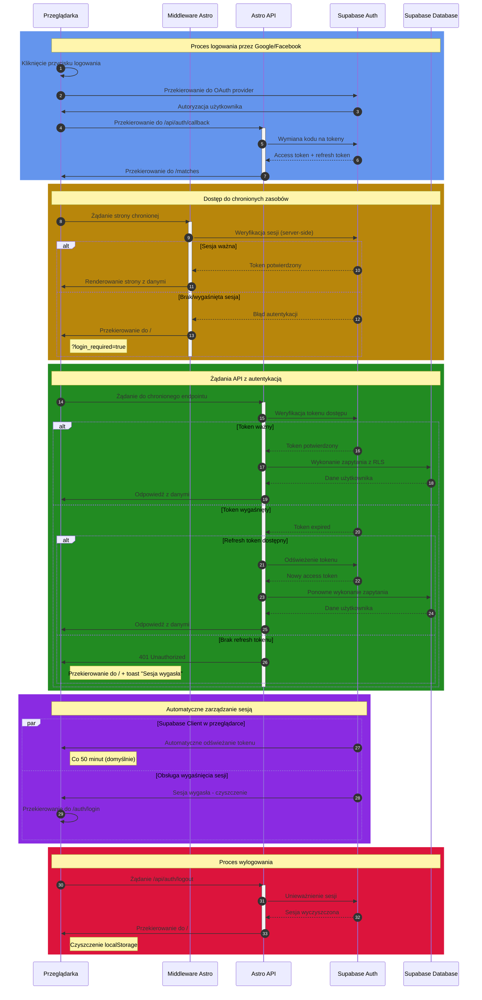

# Diagram Architektury Autentykacji - Spin Flow

```mermaid
sequenceDiagram
    autonumber

    participant Browser as Przeglądarka
    participant Middleware as Middleware Astro
    participant API as Astro API
    participant Auth as Supabase Auth
    participant DB as Supabase Database

    %% Proces logowania przez OAuth
    rect rgb(100, 149, 237)
        Note over Browser,DB: Proces logowania przez Google/Facebook
        Browser->>Browser: Kliknięcie przycisku logowania
        Browser->>Auth: Przekierowanie do OAuth provider
        Auth->>Browser: Autoryzacja użytkownika
        Browser->>API: Przekierowanie do /api/auth/callback
        activate API
        API->>Auth: Wymiana kodu na tokeny
        Auth-->>API: Access token + refresh token
        API->>Browser: Przekierowanie do /matches
        deactivate API
    end

    %% Dostęp do chronionych stron
    rect rgb(184, 134, 11)
        Note over Browser,DB: Dostęp do chronionych zasobów
        Browser->>Middleware: Żądanie strony chronionej
        activate Middleware
        Middleware->>Auth: Weryfikacja sesji (server-side)
        alt Sesja ważna
            Auth-->>Middleware: Token potwierdzony
            Middleware->>Browser: Renderowanie strony z danymi
        else Brak/wygaśnięta sesja
            Auth-->>Middleware: Błąd autentykacji
            Middleware->>Browser: Przekierowanie do /
            Note right of Browser: ?login_required=true
        end
        deactivate Middleware
    end

    %% API requests z autentykacją
    rect rgb(34, 139, 34)
        Note over Browser,DB: Żądania API z autentykacją
        Browser->>API: Żądanie do chronionego endpointu
        activate API
        API->>Auth: Weryfikacja tokenu dostępu
        alt Token ważny
            Auth-->>API: Token potwierdzony
            API->>DB: Wykonanie zapytania z RLS
            DB-->>API: Dane użytkownika
            API->>Browser: Odpowiedź z danymi
        else Token wygaśnięty
            Auth-->>API: Token expired
            alt Refresh token dostępny
                API->>Auth: Odświeżenie tokenu
                Auth-->>API: Nowy access token
                API->>DB: Ponowne wykonanie zapytania
                DB-->>API: Dane użytkownika
                API->>Browser: Odpowiedź z danymi
            else Brak refresh tokenu
                API->>Browser: 401 Unauthorized
                Note right of Browser: Przekierowanie do / + toast "Sesja wygasła"
            end
        end
        deactivate API
    end

    %% Automatyczne odświeżanie tokenu
    rect rgb(138, 43, 226)
        Note over Browser,Auth: Automatyczne zarządzanie sesją
        par Supabase Client w przeglądarce
            Auth->>Browser: Automatyczne odświeżanie tokenu
            Note right of Browser: Co 50 minut (domyślnie)
        and Obsługa wygaśnięcia sesji
            Auth->>Browser: Sesja wygasła - czyszczenie
            Browser->>Browser: Przekierowanie do /auth/login
        end
    end

    %% Proces wylogowania
    rect rgb(220, 20, 60)
        Note over Browser,DB: Proces wylogowania
        Browser->>API: Żądanie /api/auth/logout
        activate API
        API->>Auth: Unieważnienie sesji
        Auth-->>API: Sesja wyczyszczona
        API->>Browser: Przekierowanie do /
        deactivate API
        Note right of Browser: Czyszczenie localStorage
    end
```
