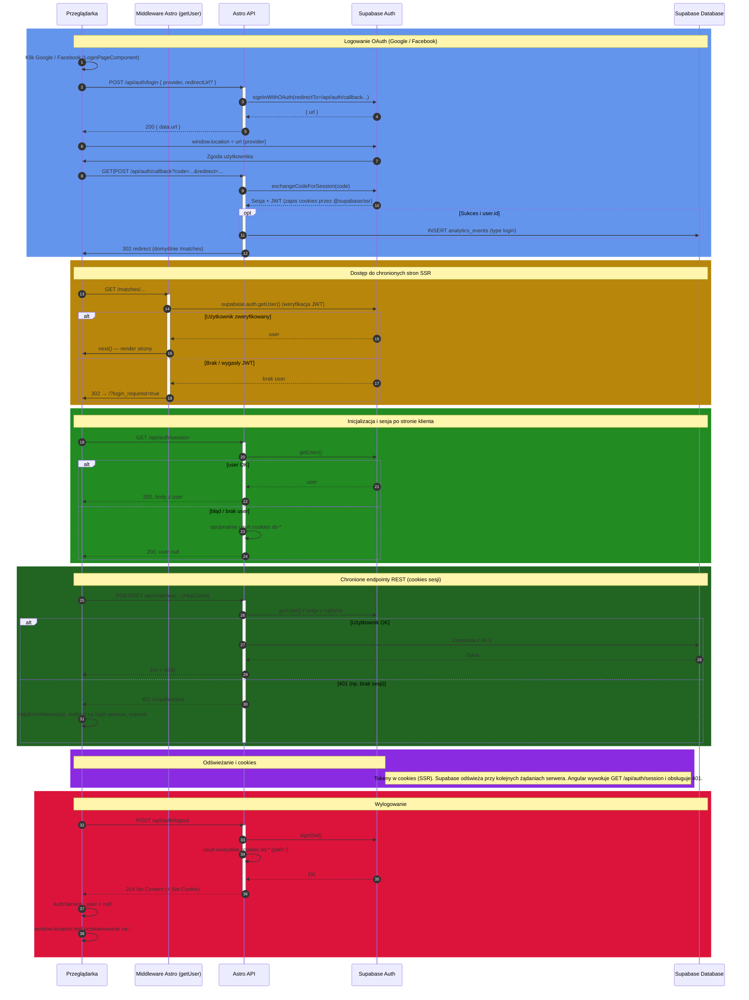

# Diagram architektury autentykacji — Spin Flow (aktualny kod)

```mermaid
sequenceDiagram
    autonumber

    participant Browser as Przeglądarka
    participant Middleware as Middleware Astro (getUser)
    participant API as Astro API
    participant Auth as Supabase Auth
    participant DB as Supabase Database

    rect rgb(100, 149, 237)
        Note over Browser,DB: Logowanie OAuth (Google / Facebook)
        Browser->>Browser: Klik Google / Facebook (LoginPageComponent)
        Browser->>API: POST /api/auth/login { provider, redirectUrl? }
        activate API
        API->>Auth: signInWithOAuth(redirectTo=/api/auth/callback...)
        Auth-->>API: { url }
        API-->>Browser: 200 { data.url }
        deactivate API
        Browser->>Auth: window.location = url (provider)
        Auth->>Browser: Zgoda użytkownika
        Browser->>API: GET|POST /api/auth/callback?code=...&redirect=...
        activate API
        API->>Auth: exchangeCodeForSession(code)
        Auth-->>API: Sesja + JWT (zapis cookies przez @supabase/ssr)
        opt Sukces i user.id
            API->>DB: INSERT analytics_events (type login)
        end
        API->>Browser: 302 redirect (domyślnie /matches)
        deactivate API
    end

    rect rgb(184, 134, 11)
        Note over Browser,DB: Dostęp do chronionych stron SSR
        Browser->>Middleware: GET /matches/...
        activate Middleware
        Middleware->>Auth: supabase.auth.getUser() (weryfikacja JWT)
        alt Użytkownik zweryfikowany
            Auth-->>Middleware: user
            Middleware->>Browser: next() — render strony
        else Brak / wygasły JWT
            Auth-->>Middleware: brak user
            Middleware->>Browser: 302 → /?login_required=true
        end
        deactivate Middleware
    end

    rect rgb(34, 139, 34)
        Note over Browser,DB: Inicjalizacja i sesja po stronie klienta
        Browser->>API: GET /api/auth/session
        activate API
        API->>Auth: getUser()
        alt user OK
            Auth-->>API: user
            API-->>Browser: 200, body z user
        else błąd / brak user
            API->>API: opcjonalnie usuń cookies sb-*
            API-->>Browser: 200, user null
        end
        deactivate API
    end

    rect rgb(34, 100, 34)
        Note over Browser,DB: Chronione endpointy REST (cookies sesji)
        Browser->>API: POST/GET /api/matches/... (HttpClient)
        activate API
        API->>Auth: getUser() / sesja z żądania
        alt Użytkownik OK
            API->>DB: Zapytania z RLS
            DB-->>API: Dane
            API-->>Browser: 2xx + body
        else 401 (np. brak sesji)
            API-->>Browser: 401 Unauthorized
            Browser->>Browser: HttpErrorInterceptor, redirect na login session_expired
        end
        deactivate API
    end

    rect rgb(138, 43, 226)
        Note over Browser,Auth: Odświeżanie i cookies
        Note right of Auth: Tokeny w cookies (SSR). Supabase odświeża przy kolejnych żądaniach serwera. Angular wywołuje GET /api/auth/session i obsługuje 401.
    end

    rect rgb(220, 20, 60)
        Note over Browser,DB: Wylogowanie
        Browser->>API: POST /api/auth/logout
        activate API
        API->>Auth: signOut()
        API->>API: usuń wszystkie cookies sb-* (path /)
        Auth-->>API: OK
        API-->>Browser: 204 No Content (+ Set-Cookie)
        deactivate API
        Browser->>Browser: AuthService._user = null
        Browser->>Browser: window.location.href przekierowanie na /
    end
```
