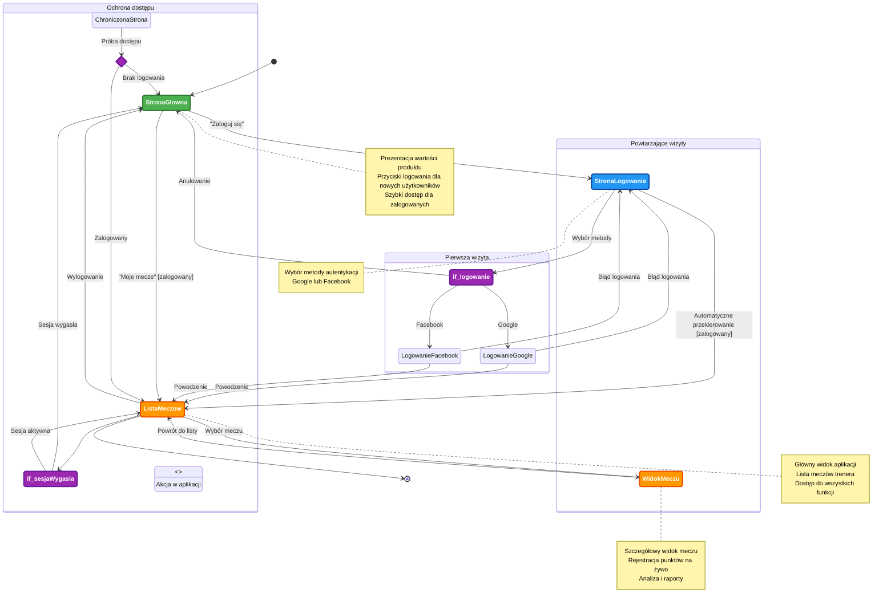

# Diagram podróży użytkownika - Moduł logowania i rejestracji

## Analiza podróży użytkownika modułu autentykacji

### Ścieżki użytkownika wymienione w dokumentacji

1. **Ścieżka użytkownika niezalogowanego do strony głównej**:
   - Użytkownik wchodzi na stronę główną
   - Widzi przycisk "Zaloguj" w topbarze i sekcji hero
   - Po kliknięciu zostaje przekierowany do strony logowania
   - Wybiera metodę logowania (Google lub Facebook)
   - Następuje przekierowanie do OAuth providera
   - Po pomyślnym logowaniu użytkownik trafia do listy swoich meczów

2. **Ścieżka użytkownika zalogowanego do strony głównej**:
   - Użytkownik wchodzi na stronę główną
   - Przycisk "Zaloguj" zmienia się na "Moje mecze"
   - Kliknięcie przycisku przekierowuje do listy meczów

3. **Ścieżka użytkownika zalogowanego do strony logowania**:
   - Użytkownik wchodzi na stronę logowania
   - System wykrywa istniejącą sesję
   - Następuje automatyczne przekierowanie do listy meczów

4. **Ścieżka wylogowania**:
   - Użytkownik klika "Wyloguj się" w menu użytkownika
   - Następuje zniszczenie sesji
   - Użytkownik zostaje przekierowany do strony głównej

5. **Ścieżka próby dostępu do chronionej strony bez logowania**:
   - Użytkownik próbuje wejść na chronioną stronę (lista meczów, widok meczu)
   - Middleware wykrywa brak sesji
   - Następuje przekierowanie do strony głównej z komunikatem o konieczności logowania

### Główne podróże i ich odpowiadające stany

1. **Podróż logowania**:
   - Stan początkowy: Strona główna (niezalogowany)
   - Stan przejściowy: Strona logowania z wyborem providera
   - Stan końcowy: Lista meczów (zalogowany)

2. **Podróż użytkownika zalogowanego**:
   - Stan początkowy: Strona główna (zalogowany)
   - Stan przejściowy: Lista meczów
   - Stan końcowy: Korzystanie z aplikacji

3. **Podróż wylogowania**:
   - Stan początkowy: Aplikacja zalogowana
   - Stan przejściowy: Proces wylogowania
   - Stan końcowy: Strona główna (niezalogowany)

4. **Podróż obsługi błędów**:
   - Stan początkowy: Próba logowania lub dostępu
   - Stan przejściowy: Błąd OAuth lub brak dostępu
   - Stan końcowy: Strona logowania z komunikatem błędu

### Punkty decyzyjne i alternatywne ścieżki

1. **Punkt decyzyjny: Czy użytkownik jest zalogowany?**
   - Tak → Dostęp do aplikacji
   - Nie → Strona logowania

2. **Punkt decyzyjny: Wybór metody logowania**
   - Google → OAuth Google
   - Facebook → OAuth Facebook
   - Anulowanie → Powrót do strony głównej

3. **Punkt decyzyjny: Wynik OAuth**
   - Powodzenie → Lista meczów
   - Niepowodzenie → Komunikat błędu na stronie logowania
   - Anulowanie przez użytkownika → Powrót do strony logowania

4. **Punkt decyzyjny: Wygasła sesja podczas korzystania z aplikacji**
   - Tak → Komunikat błędu i przekierowanie do strony głównej

### Opis celu każdego stanu

- **Strona główna (niezalogowany)**: Prezentacja wartości produktu i zachęta do logowania
- **Strona logowania**: Wybór metody autentykacji (Google lub Facebook)
- **OAuth provider**: Zewnętrzna autentykacja przez Google/Facebook
- **Callback OAuth**: Weryfikacja tokenu i utworzenie sesji
- **Lista meczów**: Główny widok aplikacji po zalogowaniu
- **Widok meczu**: Szczegółowy widok pojedynczego meczu
- **Stan błędu**: Komunikat o problemach z autentykacją
- **Strona główna (zalogowany)**: Szybki dostęp do listy meczów dla zalogowanych użytkowników

## Diagram Mermaid

