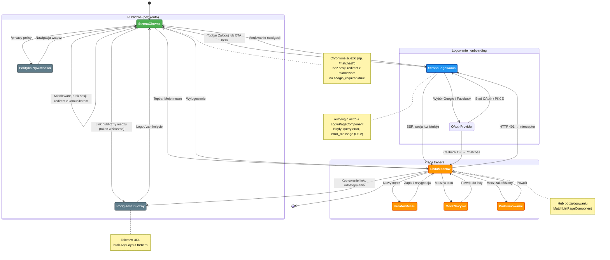

# Diagram podróży użytkownika — logowanie, treści publiczne i aplikacja trenera

## Analiza podróży (stan kodu: middleware `getUser()`, Angular 20, Astro 5)

### Ścieżki użytkownika

1. **Niezalogowany — strona główna**
   - Wejście na `/` (`LandingPageComponent`).
   - Topbar: przycisk **Zaloguj** (gdy brak sesji po `/api/auth/session`) lub **Moje mecze** (gdy sesja).
   - CTA w sekcji hero zawsze wywołuje przejście do **`/auth/login`** (niezależnie od sesji — zachowanie szablonu).
   - Po wyborze logowania: OAuth → **`/api/auth/callback`** → przekierowanie (domyślnie **`/matches`**).

2. **Zalogowany — strona główna**
   - Topbar: **Moje mecze** → nawigacja na **`/matches`**.
   - Hero CTA nadal może kierować na **`/auth/login`**; strona logowania z aktywną sesją robi **`Astro.redirect('/matches')`** po stronie SSR.

3. **Zalogowany — wejście na `/auth/login`**
   - SSR wykrywa sesję i od razu przekierowuje do **`/matches`**.

4. **Wylogowanie**
   - Menu użytkownika w `AppLayoutComponent` → **`POST /api/auth/logout`** (odpowiedź **204**) → **`window.location.href = '/'`**.

5. **Dostęp do chronionej strony bez ważnej sesji (nawigacja pełnostronicowa)**
   - Żądanie np. **`/matches`** przechodzi przez middleware: **`supabase.auth.getUser()`**.
   - Brak użytkownika → przekierowanie na **`/?login_required=true`**.
   - `LandingPageComponent` odczytuje query i pokazuje komunikat „Zaloguj się…”, czyści parametr z URL (**`replaceState`**).

6. **Wygasła lub nieważna sesja podczas pracy w SPA (API)**
   - Chronione endpointy zwracają **401**.
   - **`HttpErrorInterceptor`**: toast + przekierowanie na **`/auth/login?error=session_expired`**.

7. **Treści publiczne**
   - **`/privacy-policy`** — polityka prywatności, ten sam główny `Layout.astro` co landing.
   - **`/public/matches/:token`** — podgląd zakończonego meczu bez logowania (osobny dokument HTML, **`PublicMatchContainerComponent`** + **`GET /api/public/matches/:token`**).

### Podróże i stany (skrót)

| Podróż       | Start                 | Koniec                                         |
| ------------ | --------------------- | ---------------------------------------------- |
| Logowanie    | `/` lub `/auth/login` | `/matches`                                     |
| Trener (hub) | `/matches`            | Live / Summary / New / public link             |
| Wylogowanie  | Widok z layoutem      | `/`                                            |
| Ochrona SSR  | URL chroniony         | `/` + `?login_required=true` lub render strony |
| Sesja API    | Akcja w aplikacji     | `/auth/login?error=session_expired` przy 401   |

### Punkty decyzyjne

- **Middleware (SSR)**: `getUser()` → kontynuacja vs redirect na `/`.
- **OAuth**: sukces → docelowy `redirect` z callbacku; błąd → `/auth/login` z kodem błędu.
- **401 z API**: interceptor → login z komunikatem wygasłej sesji.

## Diagram Mermaid

```mermaid
stateDiagram-v2
    [*] --> StronaGlowna

    state "Logowanie i onboarding" as Logowanie {
        StronaGlowna --> StronaLogowania: Topbar Zaloguj lub CTA hero
        StronaLogowania --> ListaMeczow: SSR, sesja już istnieje
        StronaLogowania --> OAuthProvider: Wybór Google / Facebook
        OAuthProvider --> ListaMeczow: Callback OK → /matches
        OAuthProvider --> StronaLogowania: Błąd OAuth / PKCE
        StronaLogowania --> StronaGlowna: Anulowanie nawigacji
    }

    state "Praca trenera" as Trener {
        StronaGlowna --> ListaMeczow: Topbar Moje mecze
        ListaMeczow --> KreatorMeczu: Nowy mecz
        KreatorMeczu --> ListaMeczow: Zapis / rezygnacja
        ListaMeczow --> MeczNaZywo: Mecz w toku
        MeczNaZywo --> ListaMeczow: Powrót do listy
        ListaMeczow --> Podsumowanie: Mecz zakończony
        Podsumowanie --> ListaMeczow: Powrót
        ListaMeczow --> PodgladPubliczny: Kopiowanie linku udostępnienia
        ListaMeczow --> StronaGlowna: Wylogowanie
    }

    state "Publiczne (bez konta)" as Publiczne {
        StronaGlowna --> PolitykaPrywatnosci: /privacy-policy
        PolitykaPrywatnosci --> StronaGlowna: Nawigacja wstecz
        StronaGlowna --> PodgladPubliczny: Link publiczny meczu (token w ścieżce)
        PodgladPubliczny --> StronaGlowna: Logo / zamknięcie
    }

    StronaGlowna --> StronaGlowna: Middleware, brak sesji, redirect z komunikatem

    ListaMeczow --> StronaLogowania: HTTP 401 → interceptor

    note right of StronaGlowna
        Chronione ścieżki (np. /matches/*)
        bez sesji: redirect z middleware
        na /?login_required=true
    end note

    note right of StronaLogowania
        auth/login.astro + LoginPageComponent
        Błędy: query error, error_message (DEV)
    end note

    note right of ListaMeczow
        Hub po zalogowaniu
        MatchListPageComponent
    end note

    note right of PodgladPubliczny
        Token w URL
        brak AppLayout trenera
    end note

    ListaMeczow --> [*]

    classDef stronaPoczatkowa fill:#4CAF50,stroke:#2E7D32,stroke-width:3px,color:#ffffff,font-weight:bold
    classDef stronaLogowania fill:#2196F3,stroke:#0D47A1,stroke-width:3px,color:#ffffff,font-weight:bold
    classDef stanAplikacji fill:#FF9800,stroke:#E65100,stroke-width:3px,color:#ffffff,font-weight:bold
    classDef publiczne fill:#607D8B,stroke:#37474F,stroke-width:2px,color:#ffffff,font-weight:bold

    class StronaGlowna stronaPoczatkowa
    class StronaLogowania stronaLogowania
    class ListaMeczow,KreatorMeczu,MeczNaZywo,Podsumowanie stanAplikacji
    class PolitykaPrywatnosci,PodgladPubliczny publiczne
```
