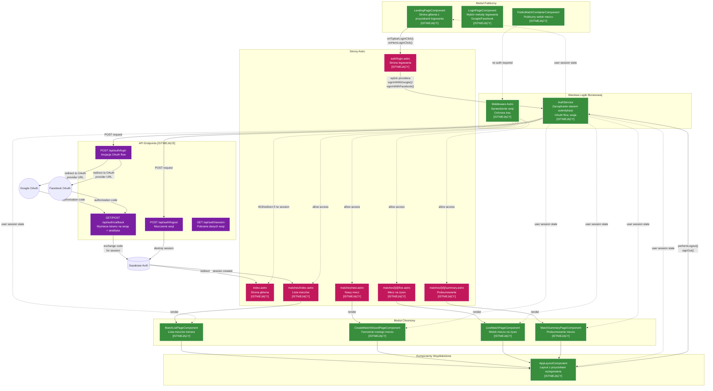

```mermaid
flowchart TD
    %% Komponenty publiczne
    subgraph "Moduł Publiczny"
        A["LandingPageComponent<br/>Strona główna z przyciskami logowania<br/>[ISTNIEJĄCY]"]
        B["LoginPageComponent<br/>Wybór metody logowania<br/>Google/Facebook<br/>[ISTNIEJĄCY]"]
        C["PublicMatchContainerComponent<br/>Publiczny widok meczu<br/>[ISTNIEJĄCY]"]
    end

    %% Komponenty chronione
    subgraph "Moduł Chroniony"
        D["MatchListPageComponent<br/>Lista meczów trenera<br/>[ISTNIEJĄCY]"]
        E["CreateMatchWizardPageComponent<br/>Tworzenie nowego meczu<br/>[ISTNIEJĄCY]"]
        F["LiveMatchPageComponent<br/>Widok meczu na żywo<br/>[ISTNIEJĄCY]"]
        G["MatchSummaryPageComponent<br/>Podsumowanie meczu<br/>[ISTNIEJĄCY]"]
    end

    %% Komponenty współdzielone
    subgraph "Komponenty Współdzielone"
        H["AppLayoutComponent<br/>Layout z przyciskiem wylogowania<br/>[ISTNIEJĄCY]"]
    end

    %% Serwisy i API
    subgraph "Warstwa Logiki Biznesowej"
        I["AuthService<br/>Zarządzanie stanem autentykacji<br/>OAuth flow, sesja<br/>[ISTNIEJĄCY]"]
        J["Middleware Astro<br/>Sprawdzenie sesji<br/>Ochrona tras<br/>[ISTNIEJĄCY]"]
    end

    subgraph "API Endpoints [ISTNIEJĄCE]"
        K["POST /api/auth/login<br/>Inicjacja OAuth flow"]
        L["GET/POST /api/auth/callback<br/>Wymiana tokenu na sesję + analityka"]
        M["POST /api/auth/logout<br/>Niszczenie sesji"]
        N["GET /api/auth/session<br/>Pobranie danych sesji"]
    end

    %% Strony Astro
    subgraph "Strony Astro"
        O["index.astro<br/>Strona główna<br/>[ISTNIEJĄCY]"]
        P["auth/login.astro<br/>Strona logowania<br/>[ISTNIEJĄCY]"]
        Q["matches/index.astro<br/>Lista meczów<br/>[ISTNIEJĄCY]"]
        R["matches/new.astro<br/>Nowy mecz<br/>[ISTNIEJĄCY]"]
        S["matches/[id]/live.astro<br/>Mecz na żywo<br/>[ISTNIEJĄCY]"]
        T["matches/[id]/summary.astro<br/>Podsumowanie<br/>[ISTNIEJĄCY]"]
    end

    %% Przepływ danych - niezalogowany użytkownik
    A -->|"onTopbarLoginClick()<br/>onHeroLoginClick()"| P
    P -->|"wybór providera<br/>signInWithGoogle()/<br/>signInWithFacebook()"| I
    I -->|"POST request"| K
    K -->|"redirect to OAuth<br/>provider URL"| Google((Google OAuth))
    K -->|"redirect to OAuth<br/>provider URL"| Facebook((Facebook OAuth))

    %% Przepływ callback OAuth
    Google -->|"authorization code"| L
    Facebook -->|"authorization code"| L
    L -->|"exchange code<br/>for session"| Supabase[(Supabase Auth)]
    Supabase -->|"session created"| Q

    %% Przepływ chronionych stron
    Q -->|"render"| D
    R -->|"render"| E
    S -->|"render"| F
    T -->|"render"| G

    %% Wszystkie chronione strony używają layoutu
    D --> H
    E --> H
    F --> H
    G --> H

    %% Wylogowanie
    H -->|"performLogout()<br/>signOut()"| I
    I -->|"POST request"| M
    M -->|"destroy session"| Supabase
    Supabase -->|"redirect"| O

    %% Middleware sprawdza wszystkie chronione strony
    J -.->|"403/redirect if no session"| O
    J -.->|"allow access"| Q
    J -.->|"allow access"| R
    J -.->|"allow access"| S
    J -.->|"allow access"| T

    %% Stan aplikacji - AuthService
    I -.->|"user session state"| A
    I -.->|"user session state"| H
    I -.->|"user session state"| D
    I -.->|"user session state"| E
    I -.->|"user session state"| F
    I -.->|"user session state"| G

    %% Komponent publicznego meczu - niezależny
    C -.->|"no auth required"| J

    %% Stylizacja dla wyróżnienia komponentów
    classDef existing fill:#388e3c,stroke:#ffffff,stroke-width:2px,color:#ffffff
    classDef api fill:#7b1fa2,stroke:#ffffff,stroke-width:2px,color:#ffffff
    classDef astro fill:#c2185b,stroke:#ffffff,stroke-width:2px,color:#ffffff

    class A,B,C,D,E,F,G,H,I,J existing
    class K,L,M,N api
    class O,P,Q,R,S,T astro
```
