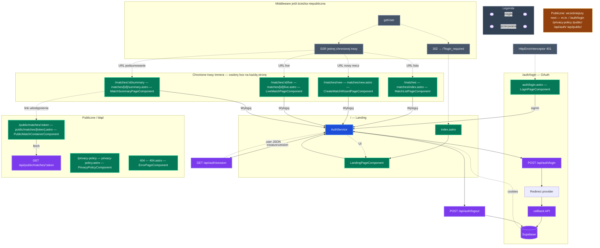

# Diagram UI — jak go czytać

**Strona główna (`/`) a sesja:** `index.astro` nie wywołuje `getSession()` w frontmatterze — tylko `LandingPageComponent` (`client:only="angular"`). `AuthService.initializeSession()` woła **`GET /api/auth/session`** w przeglądarce.

**Legenda strzałek w diagramie przepływu:** **ciągła** — kolejny krok. **Przerywana** — zwrot danych, redirect, reguła middleware.

---

## Pełne mapowanie: ścieżka URL → strona Astro → komponent Angular

Źródło: `src/pages/**/*.astro` (stan repozytorium).

| Ścieżka URL              | Plik Astro                     | Komponent Angular (główny)                                           |
| ------------------------ | ------------------------------ | -------------------------------------------------------------------- |
| `/`                      | `index.astro`                  | `LandingPageComponent`                                               |
| `/auth/login`            | `auth/login.astro`             | `LoginPageComponent`                                                 |
| `/matches`               | `matches/index.astro`          | `MatchListPageComponent`                                             |
| `/matches/new`           | `matches/new.astro`            | `CreateMatchWizardPageComponent`                                     |
| `/matches/:id/live`      | `matches/[id]/live.astro`      | `LiveMatchPageComponent`                                             |
| `/matches/:id/summary`   | `matches/[id]/summary.astro`   | `MatchSummaryPageComponent`                                          |
| `/public/matches/:token` | `public/matches/[token].astro` | `PublicMatchContainerComponent` (minimalny HTML, bez `Layout.astro`) |
| `/privacy-policy`        | `privacy-policy.astro`         | `PrivacyPolicyComponent`                                             |
| _404 / nieznany URL_     | `404.astro`                    | `ErrorPageComponent` (`errorType="not_found"`)                       |

**Layout:** `Layout.astro` owija strony z tabeli **oprócz** `/public/matches/:token` (osobny dokument HTML).

**AppLayout:** `AppLayoutComponent` jest **wewnątrz** komponentów chronionych (lista, kreator, live, summary), nie jest osobną trasą.

---

## Endpointy API (REST, `src/pages/api`)

| Grupa              | Metoda i ścieżka                                                                                                                                                                                                                                                        |
| ------------------ | ----------------------------------------------------------------------------------------------------------------------------------------------------------------------------------------------------------------------------------------------------------------------- |
| **Auth**           | `POST /api/auth/login`, `GET\|POST /api/auth/callback`, `POST /api/auth/logout`, `GET /api/auth/session`                                                                                                                                                                |
| **Mecze**          | `GET /api/matches`, `POST /api/matches/create`, `GET /api/matches/:id`, `PATCH /api/matches/:id/update`, `POST /api/matches/:id/finish`, `DELETE /api/matches/:id/delete`, `GET /api/matches/:id/sets`, `POST /api/matches/:id/share`, `GET /api/matches/:id/ai-report` |
| **Sety / punkty**  | `GET /api/sets/:id`, `POST /api/sets/:id/finish`, `GET /api/sets/:id/points`, `POST /api/sets/:id/points/create`, `DELETE /api/sets/:id/points/delete`                                                                                                                  |
| **Publiczny mecz** | `GET /api/public/matches/:token`                                                                                                                                                                                                                                        |
| **Inne**           | `POST /api/analytics/events`, `GET /api/dictionary/labels`, `GET /api/tags`                                                                                                                                                                                             |

---

## Diagram przepływu (uproszczony — nie zastępuje tabel)

Poniżej **jeden** graf: wspólny `AuthService`, OAuth, middleware, chronione widoki **zbiorczo** (szczegóły tras w tabeli powyżej).

**Uwaga do diagramu:** Z **jednego** żądania wynika **dokładnie jedna** chroniona strona — cztery przerywane strzałki z `PG` to **alternatywy** (routing wg URL), a nie cztery równoległe renderowania. Każdy box ma własną ścieżkę, plik `.astro` i komponent (jak w tabeli na górze).

---

**Uwagi**

- **Publiczne URL:** `PUBNOTE` — bez strzałki z middleware; w kodzie `isPublicPath` przed `getUser` (`src/middleware/index.ts`).
- **`/auth/login`:** opcjonalny redirect „już zalogowany” w `auth/login.astro` (`getSession` w frontmatterze).
- **401 z XHR:** interceptor → `/auth/login?error=session_expired`.
- **404:** `ErrorPageComponent` — osobna strona; nie jest na liście `PUBLIC_PATHS` w middleware jako stała ścieżka (nieznany URL); zachowanie zależy od hostingu i routingu Astro.
